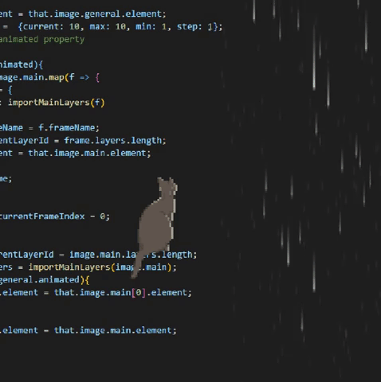

## Kouranshi

  
  
  

 

  

  <!-- Nova div para o GIF -->
  

    
  

  
  <!-- Título e tecnologias -->
  
 <!-- Move o título mais para cima -->
    <h1>Best Technologies <3</h1>
    

    

      
      
      
      
      
      
    

  

           <!-- Espaçamento entre as seções -->

  <!-- Social Media -->
  
 <!-- Move a seção Social Media mais para baixo -->
    <h1 align="center">Social Media</h1>
    

    
    
    
  

